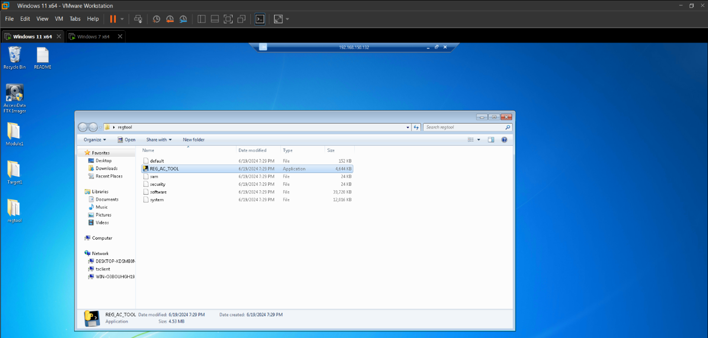
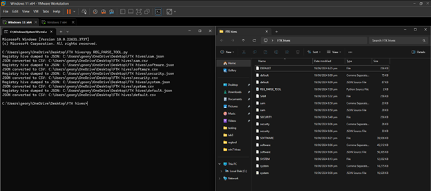
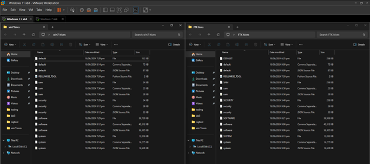

[back](./index.md)

# 4-in-1 Shell Items Parser Tool
##### GitHub Repository: [https://github.com/JohnBadels/NSSECU3_WFP](https://github.com/JohnBadels/NSSECU3_WFP)
A dynamic and versatile tool that can operate live or offline capable of parsing and collecting various types of Shell Items, including shortcuts, jump lists, prefetch files, and shellbags, by integrating prebuilt tools. 

### Key Features
#### Registry Acquisition Tool
- Extracts key registry hives (Live)
  - SAM
  - SECURITY
  - SOFTWARE
  - SYSTEM
  - DEFAULT

#### Registry Parsing Tool
- Parses registry hives
  - from Registry Acquisition Tool (Live)
  - from FTK Imager (Offline)
- Converts parsed data to .csv and .json

### Screenshots
##### Registry Acquisition Tool w/ extracted registry hives

##### Registry Parser Tool w/ parsed registry hives from Registry Acquisition Tool

##### Registry Parser Tool w/ parsed registry hives from FTK Imager

##### Comparison of parsed registry hives from Registry Acquisition Tool and FTK Imager

