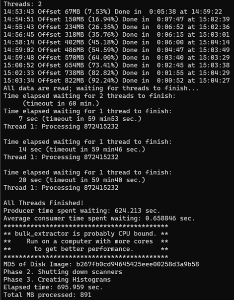
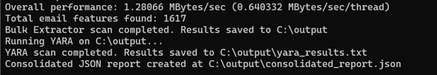
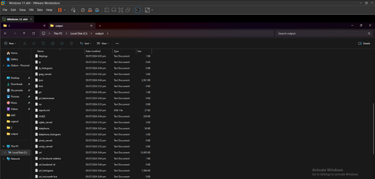
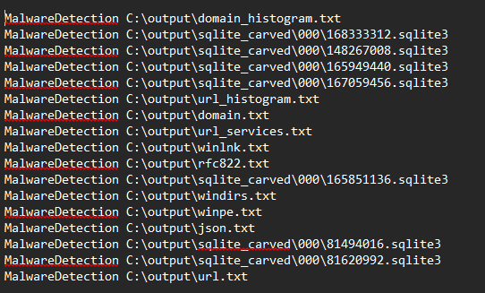
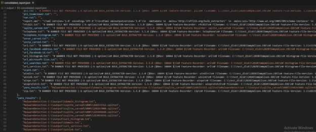

[back](./index.md)

# Bulk Extractor and YARA Orchestration Tool
##### GitHub Repository: [https://github.com/JohnBadels/NSSECU3_MCO2_ORCHESTRATION](https://github.com/JohnBadels/NSSECU3_MCO2_ORCHESTRATION)
Unified tool that streamlines the forensic analysis processes of Bulk Extractor and YARA to provide a seamless workflow for users.

### Key Features
- Use Bulk Extractor's function to
  - recover deleted files
  - extract metadata
  - identify a wide range of digital artifacts
- Use YARA's pattern-matching capabilities to detect
  - malware
  - suspicious files
  - potential security threats

### Screenshots
##### Bulk Extractor running in the tool

##### YARA running in the tool

##### Artifacts found by Bulk Extractor

##### YARA results

##### Consolidated report from the tool

