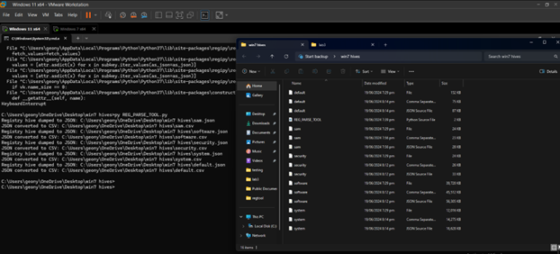

[back](./index.md)

# Registry Acquisition and Parsing Tool
##### GitHub Repository: [https://github.com/JohnBadels/SECU3-LAB-3](https://github.com/JohnBadels/SECU3-LAB-3)
A tool for acquiring and parsing Windows Registry hives, capable of operating in both live and offline environments.

### Key Features
#### Registry Acquisition Tool
- Extracts key registry hives (Live)
  - SAM
  - SECURITY
  - SOFTWARE
  - SYSTEM
  - DEFAULT

#### Registry Parsing Tool
- Parses registry hives
  - from Registry Acquisition Tool (Live)
  - from FTK Imager (Offline)
- Converts parsed data to .csv and .json

### Screenshots
##### Registry Acquisition Tool w/ extracted registry hives

##### Registry Parser Tool w/ parsed registry hives from Registry Acquisition Tool

##### Registry Parser Tool w/ parsed registry hives from FTK Imager

##### Comparison of parsed registry hives from Registry Acquisition Tool and FTK Imager

